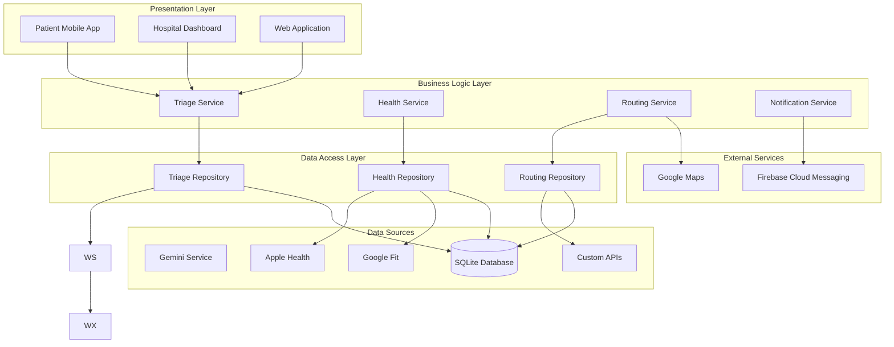
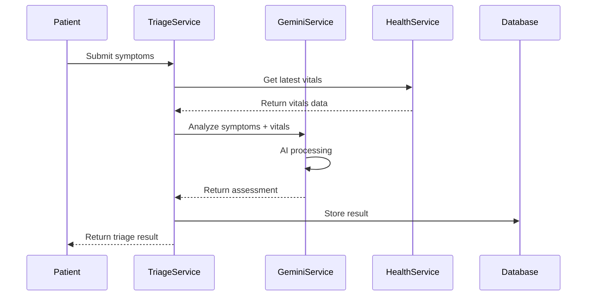
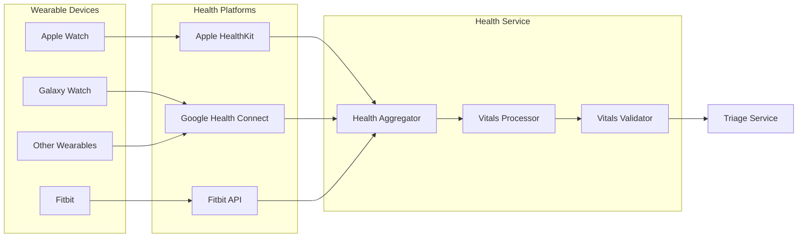
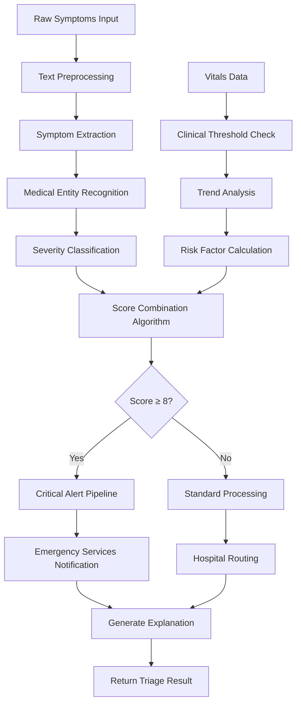
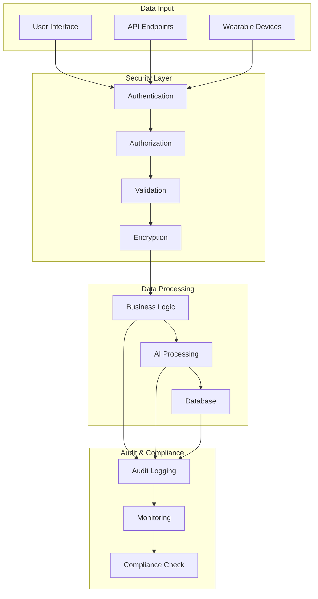
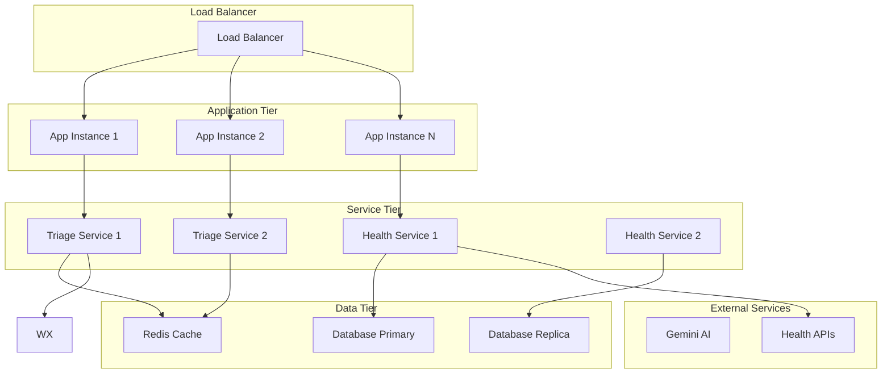
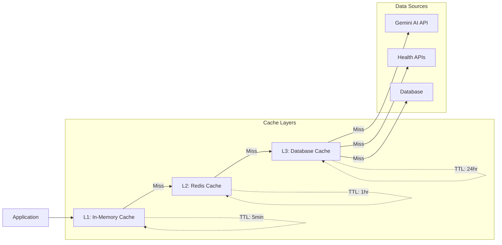
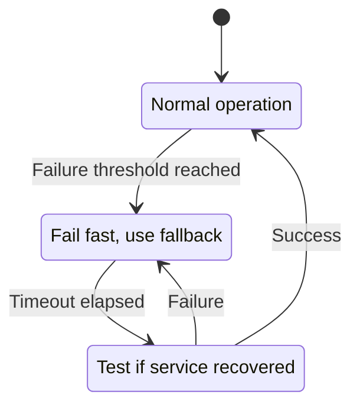
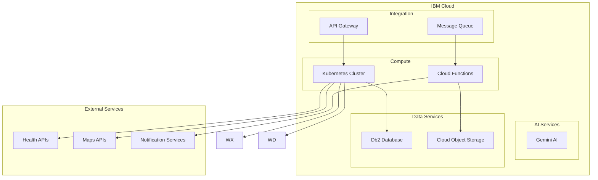

# Architecture Guide

## System Architecture Overview

Triage-BIOS.ai follows a clean, layered architecture designed for scalability, testability, and maintainability. The system is built using Flutter for cross-platform compatibility and integrates with Google Gemini AI for AI-powered triage decisions.

## Architecture Diagram



## Layer Responsibilities

### 1. Presentation Layer

**Purpose**: User interface and user experience
- **Patient Mobile App**: Flutter mobile application for patients
- **Hospital Dashboard**: Web-based dashboard for healthcare providers
- **Web Application**: Responsive web interface for broader access

**Key Components**:
- UI widgets and screens
- State management (BLoC pattern)
- User input validation
- Real-time updates

### 2. Business Logic Layer

**Purpose**: Core application logic and orchestration
- **Triage Service**: Main orchestration for triage assessments
- **Health Service**: Wearable device integration and vitals processing
- **Routing Service**: Hospital routing and optimization
- **Notification Service**: Real-time alerts and communications

**Key Responsibilities**:
- Business rule enforcement
- Data validation and transformation
- Service orchestration
- Error handling and logging

### 3. Data Access Layer

**Purpose**: Data persistence and external service integration
- **Repositories**: Abstract data access patterns
- **Data Sources**: Concrete implementations for data retrieval
- **Models**: Data transfer objects and serialization

**Key Features**:
- Repository pattern implementation
- Data caching strategies
- Offline capability
- Data synchronization

## Core Services Architecture

### Triage Service Flow



### Health Service Integration



## Data Models

### Core Entities

```mermaid
classDiagram
    class PatientVitals {
        +int? heartRate
        +String? bloodPressure
        +double? temperature
        +double? oxygenSaturation
        +int? respiratoryRate
        +DateTime timestamp
        +String? deviceSource
        +bool hasCriticalVitals()
        +double vitalsSeverityBoost()
    }
    
    class TriageResult {
        +String assessmentId
        +double severityScore
        +UrgencyLevel urgencyLevel
        +String explanation
        +List~String~ keySymptoms
        +List~String~ recommendedActions
        +PatientVitals? vitals
        +DateTime timestamp
        +bool isCritical()
        +String vitalsExplanation()
    }
    
    class Patient {
        +String id
        +Demographics demographics
        +MedicalHistory medicalHistory
        +CurrentSymptoms currentSymptoms
        +Location location
    }
    
    class Hospital {
        +String id
        +String name
        +Location location
        +Capabilities capabilities
        +Capacity capacity
        +Performance performance
    }
    
    PatientVitals ||--o{ TriageResult
    Patient ||--o{ TriageResult
    TriageResult }o--|| Hospital
    }
```

## AI Processing Pipeline

### Symptom Analysis Flow



### Vitals Processing Algorithm

```mermaid
flowchart TD
    A[Raw Vitals Data] --> B[Data Validation]
    B --> C[Quality Assessment]
    C --> D{Quality > Threshold?}
    
    D -->|No| E[Flag Low Quality]
    D -->|Yes| F[Clinical Threshold Analysis]
    
    F --> G[Heart Rate Check]
    F --> H[SpO2 Check]
    F --> I[Temperature Check]
    F --> J[Blood Pressure Check]
    
    G --> K[Calculate HR Boost]
    H --> L[Calculate SpO2 Boost]
    I --> M[Calculate Temp Boost]
    J --> N[Calculate BP Boost]
    
    K --> O[Combine Boosts]
    L --> O
    M --> O
    N --> O
    
    O --> P[Apply Boost Cap (3.0)]
    E --> Q[Return with Warning]
    P --> R[Return Enhanced Score]
```

## Security Architecture

### Data Protection Flow



## Scalability Considerations

### Horizontal Scaling Strategy



## Performance Optimization

### Caching Strategy



## Error Handling Strategy

### Circuit Breaker Pattern



## Deployment Architecture

### Cloud Infrastructure



This architecture ensures:
- **Scalability**: Horizontal scaling with load balancing
- **Reliability**: Circuit breakers and fallback mechanisms
- **Performance**: Multi-layer caching and optimization
- **Security**: End-to-end encryption and audit logging
- **Maintainability**: Clean separation of concerns and modular design