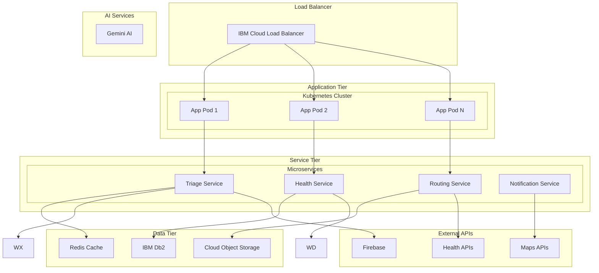

# Deployment Guide

## Overview

This guide covers deploying Triage-BIOS.ai across different environments, from development to production. The system supports multiple deployment strategies including cloud-native, on-premises, and hybrid deployments.

## Deployment Architecture



## Environment Setup

### Development Environment

#### Prerequisites

```bash
# Install required tools
flutter --version  # 3.8.1+
docker --version   # 20.0+
kubectl version    # 1.25+
helm version       # 3.10+
```

#### Local Development Setup

```bash
# Clone repository
git clone https://github.com/triage-bios-ai/triage-bios-ai.git
cd triage-bios-ai

# Install dependencies
flutter pub get

# Set up environment variables
cp .env.example .env.development
```

#### Environment Variables

```bash
# .env.development
ENVIRONMENT=development
DEBUG_MODE=true
LOG_LEVEL=debug

# Google Gemini AI
GEMINI_API_KEY=your-dev-api-key

# Database
DATABASE_URL=sqlite:///data/triage_dev.db
REDIS_URL=redis://localhost:6379

# Health Services
APPLE_HEALTH_ENABLED=true
GOOGLE_HEALTH_ENABLED=true
FITBIT_CLIENT_ID=your-fitbit-client-id

# External APIs
GOOGLE_MAPS_API_KEY=your-maps-api-key
FIREBASE_PROJECT_ID=your-firebase-project
```

#### Docker Development

```yaml
# docker-compose.dev.yml
version: '3.8'

services:
  app:
    build:
      context: .
      dockerfile: Dockerfile.dev
    ports:
      - "8080:8080"
    environment:
      - ENVIRONMENT=development
    volumes:
      - .:/app
      - /app/build
    depends_on:
      - redis
      - postgres

  redis:
    image: redis:7-alpine
    ports:
      - "6379:6379"

  postgres:
    image: postgres:15-alpine
    environment:
      POSTGRES_DB: triage_dev
      POSTGRES_USER: dev_user
      POSTGRES_PASSWORD: dev_password
    ports:
      - "5432:5432"
    volumes:
      - postgres_data:/var/lib/postgresql/data

volumes:
  postgres_data:
```

```bash
# Start development environment
docker-compose -f docker-compose.dev.yml up -d
```

### Staging Environment

#### IBM Cloud Setup

```bash
# Install IBM Cloud CLI
curl -fsSL https://clis.cloud.ibm.com/install/linux | sh

# Login to IBM Cloud
ibmcloud login --apikey your-api-key

# Target resource group and region
ibmcloud target -g triage-bios-ai -r us-south

# Create Kubernetes cluster
ibmcloud ks cluster create classic \
  --name triage-staging \
  --location dal10 \
  --workers 3 \
  --machine-type b3c.4x16 \
  --hardware shared
```

#### Kubernetes Configuration

```yaml
# k8s/staging/namespace.yaml
apiVersion: v1
kind: Namespace
metadata:
  name: triage-staging
  labels:
    environment: staging
```

```yaml
# k8s/staging/configmap.yaml
apiVersion: v1
kind: ConfigMap
metadata:
  name: triage-config
  namespace: triage-staging
data:
  ENVIRONMENT: "staging"
  LOG_LEVEL: "info"
  GEMINI_BASE_URL: "https://generativelanguage.googleapis.com"
  REDIS_URL: "redis://redis-service:6379"
```

```yaml
# k8s/staging/secret.yaml
apiVersion: v1
kind: Secret
metadata:
  name: triage-secrets
  namespace: triage-staging
type: Opaque
data:
  GEMINI_API_KEY: <base64-encoded-key>
  DATABASE_PASSWORD: <base64-encoded-password>
  GOOGLE_MAPS_API_KEY: <base64-encoded-key>
```

```yaml
# k8s/staging/deployment.yaml
apiVersion: apps/v1
kind: Deployment
metadata:
  name: triage-app
  namespace: triage-staging
spec:
  replicas: 2
  selector:
    matchLabels:
      app: triage-app
  template:
    metadata:
      labels:
        app: triage-app
    spec:
      containers:
      - name: triage-app
        image: us.icr.io/triage-bios-ai/app:staging-latest
        ports:
        - containerPort: 8080
        env:
        - name: ENVIRONMENT
          valueFrom:
            configMapKeyRef:
              name: triage-config
              key: ENVIRONMENT
        - name: GEMINI_API_KEY
          valueFrom:
            secretKeyRef:
              name: triage-secrets
              key: GEMINI_API_KEY
        resources:
          requests:
            memory: "512Mi"
            cpu: "250m"
          limits:
            memory: "1Gi"
            cpu: "500m"
        livenessProbe:
          httpGet:
            path: /health
            port: 8080
          initialDelaySeconds: 30
          periodSeconds: 10
        readinessProbe:
          httpGet:
            path: /ready
            port: 8080
          initialDelaySeconds: 5
          periodSeconds: 5
```

```yaml
# k8s/staging/service.yaml
apiVersion: v1
kind: Service
metadata:
  name: triage-service
  namespace: triage-staging
spec:
  selector:
    app: triage-app
  ports:
  - port: 80
    targetPort: 8080
  type: ClusterIP
```

```yaml
# k8s/staging/ingress.yaml
apiVersion: networking.k8s.io/v1
kind: Ingress
metadata:
  name: triage-ingress
  namespace: triage-staging
  annotations:
    kubernetes.io/ingress.class: "nginx"
    cert-manager.io/cluster-issuer: "letsencrypt-prod"
spec:
  tls:
  - hosts:
    - staging.triage-bios.ai
    secretName: triage-staging-tls
  rules:
  - host: staging.triage-bios.ai
    http:
      paths:
      - path: /
        pathType: Prefix
        backend:
          service:
            name: triage-service
            port:
              number: 80
```

#### Deployment Script

```bash
#!/bin/bash
# deploy-staging.sh

set -e

echo "🚀 Deploying Triage-BIOS.ai to Staging"

# Build and push Docker image
echo "📦 Building Docker image..."
docker build -t us.icr.io/triage-bios-ai/app:staging-${BUILD_NUMBER} .
docker push us.icr.io/triage-bios-ai/app:staging-${BUILD_NUMBER}

# Update Kubernetes manifests
echo "📝 Updating Kubernetes manifests..."
sed -i "s|staging-latest|staging-${BUILD_NUMBER}|g" k8s/staging/deployment.yaml

# Apply Kubernetes resources
echo "☸️ Applying Kubernetes resources..."
kubectl apply -f k8s/staging/namespace.yaml
kubectl apply -f k8s/staging/configmap.yaml
kubectl apply -f k8s/staging/secret.yaml
kubectl apply -f k8s/staging/deployment.yaml
kubectl apply -f k8s/staging/service.yaml
kubectl apply -f k8s/staging/ingress.yaml

# Wait for deployment
echo "⏳ Waiting for deployment to complete..."
kubectl rollout status deployment/triage-app -n triage-staging --timeout=300s

# Run health check
echo "🏥 Running health check..."
kubectl run health-check --rm -i --restart=Never --image=curlimages/curl -- \
  curl -f http://triage-service.triage-staging.svc.cluster.local/health

echo "✅ Staging deployment completed successfully!"
```

### Production Environment

#### High Availability Setup

```yaml
# k8s/production/deployment.yaml
apiVersion: apps/v1
kind: Deployment
metadata:
  name: triage-app
  namespace: triage-production
spec:
  replicas: 5
  strategy:
    type: RollingUpdate
    rollingUpdate:
      maxSurge: 2
      maxUnavailable: 1
  selector:
    matchLabels:
      app: triage-app
  template:
    metadata:
      labels:
        app: triage-app
    spec:
      affinity:
        podAntiAffinity:
          preferredDuringSchedulingIgnoredDuringExecution:
          - weight: 100
            podAffinityTerm:
              labelSelector:
                matchExpressions:
                - key: app
                  operator: In
                  values:
                  - triage-app
              topologyKey: kubernetes.io/hostname
      containers:
      - name: triage-app
        image: us.icr.io/triage-bios-ai/app:production-latest
        ports:
        - containerPort: 8080
        resources:
          requests:
            memory: "1Gi"
            cpu: "500m"
          limits:
            memory: "2Gi"
            cpu: "1000m"
        livenessProbe:
          httpGet:
            path: /health
            port: 8080
          initialDelaySeconds: 60
          periodSeconds: 30
          timeoutSeconds: 10
          failureThreshold: 3
        readinessProbe:
          httpGet:
            path: /ready
            port: 8080
          initialDelaySeconds: 10
          periodSeconds: 5
          timeoutSeconds: 5
          failureThreshold: 3
```

#### Auto-scaling Configuration

```yaml
# k8s/production/hpa.yaml
apiVersion: autoscaling/v2
kind: HorizontalPodAutoscaler
metadata:
  name: triage-app-hpa
  namespace: triage-production
spec:
  scaleTargetRef:
    apiVersion: apps/v1
    kind: Deployment
    name: triage-app
  minReplicas: 5
  maxReplicas: 20
  metrics:
  - type: Resource
    resource:
      name: cpu
      target:
        type: Utilization
        averageUtilization: 70
  - type: Resource
    resource:
      name: memory
      target:
        type: Utilization
        averageUtilization: 80
  behavior:
    scaleUp:
      stabilizationWindowSeconds: 60
      policies:
      - type: Percent
        value: 100
        periodSeconds: 15
    scaleDown:
      stabilizationWindowSeconds: 300
      policies:
      - type: Percent
        value: 10
        periodSeconds: 60
```

#### Database Setup

```yaml
# k8s/production/postgres.yaml
apiVersion: postgresql.cnpg.io/v1
kind: Cluster
metadata:
  name: postgres-cluster
  namespace: triage-production
spec:
  instances: 3
  
  postgresql:
    parameters:
      max_connections: "200"
      shared_buffers: "256MB"
      effective_cache_size: "1GB"
      
  bootstrap:
    initdb:
      database: triage_production
      owner: triage_user
      secret:
        name: postgres-credentials
        
  storage:
    size: 100Gi
    storageClass: ibmc-block-gold
    
  monitoring:
    enabled: true
    
  backup:
    retentionPolicy: "30d"
    barmanObjectStore:
      destinationPath: "s3://triage-backups/postgres"
      s3Credentials:
        accessKeyId:
          name: s3-credentials
          key: ACCESS_KEY_ID
        secretAccessKey:
          name: s3-credentials
          key: SECRET_ACCESS_KEY
```

#### Redis Cluster

```yaml
# k8s/production/redis.yaml
apiVersion: redis.redis.opstreelabs.in/v1beta1
kind: RedisCluster
metadata:
  name: redis-cluster
  namespace: triage-production
spec:
  clusterSize: 6
  kubernetesConfig:
    image: redis:7.0
    imagePullPolicy: IfNotPresent
    resources:
      requests:
        cpu: 100m
        memory: 128Mi
      limits:
        cpu: 500m
        memory: 512Mi
  storage:
    volumeClaimTemplate:
      spec:
        accessModes: ["ReadWriteOnce"]
        resources:
          requests:
            storage: 10Gi
        storageClassName: ibmc-block-gold
```

## CI/CD Pipeline

### GitHub Actions Workflow

```yaml
# .github/workflows/deploy.yml
name: Deploy to Production

on:
  push:
    branches: [main]
    tags: ['v*']

env:
  REGISTRY: us.icr.io
  IMAGE_NAME: triage-bios-ai/app

jobs:
  test:
    runs-on: ubuntu-latest
    steps:
      - uses: actions/checkout@v3
      
      - name: Setup Flutter
        uses: subosito/flutter-action@v2
        with:
          flutter-version: '3.8.1'
          
      - name: Install dependencies
        run: flutter pub get
        
      - name: Run tests
        run: flutter test --coverage
        
      - name: Upload coverage
        uses: codecov/codecov-action@v3
        with:
          file: coverage/lcov.info

  build:
    needs: test
    runs-on: ubuntu-latest
    outputs:
      image-tag: ${{ steps.meta.outputs.tags }}
      image-digest: ${{ steps.build.outputs.digest }}
    steps:
      - uses: actions/checkout@v3
      
      - name: Setup Docker Buildx
        uses: docker/setup-buildx-action@v2
        
      - name: Login to IBM Cloud Registry
        uses: docker/login-action@v2
        with:
          registry: ${{ env.REGISTRY }}
          username: iamapikey
          password: ${{ secrets.IBM_CLOUD_API_KEY }}
          
      - name: Extract metadata
        id: meta
        uses: docker/metadata-action@v4
        with:
          images: ${{ env.REGISTRY }}/${{ env.IMAGE_NAME }}
          tags: |
            type=ref,event=branch
            type=ref,event=pr
            type=semver,pattern={{version}}
            type=semver,pattern={{major}}.{{minor}}
            
      - name: Build and push
        id: build
        uses: docker/build-push-action@v4
        with:
          context: .
          push: true
          tags: ${{ steps.meta.outputs.tags }}
          labels: ${{ steps.meta.outputs.labels }}
          cache-from: type=gha
          cache-to: type=gha,mode=max

  deploy-staging:
    needs: build
    runs-on: ubuntu-latest
    environment: staging
    steps:
      - uses: actions/checkout@v3
      
      - name: Setup kubectl
        uses: azure/setup-kubectl@v3
        with:
          version: 'v1.25.0'
          
      - name: Configure kubectl
        run: |
          echo "${{ secrets.KUBE_CONFIG_STAGING }}" | base64 -d > kubeconfig
          export KUBECONFIG=kubeconfig
          
      - name: Deploy to staging
        run: |
          sed -i "s|IMAGE_TAG|${{ needs.build.outputs.image-tag }}|g" k8s/staging/deployment.yaml
          kubectl apply -f k8s/staging/
          kubectl rollout status deployment/triage-app -n triage-staging

  deploy-production:
    needs: [build, deploy-staging]
    runs-on: ubuntu-latest
    environment: production
    if: startsWith(github.ref, 'refs/tags/v')
    steps:
      - uses: actions/checkout@v3
      
      - name: Setup kubectl
        uses: azure/setup-kubectl@v3
        
      - name: Configure kubectl
        run: |
          echo "${{ secrets.KUBE_CONFIG_PRODUCTION }}" | base64 -d > kubeconfig
          export KUBECONFIG=kubeconfig
          
      - name: Deploy to production
        run: |
          sed -i "s|IMAGE_TAG|${{ needs.build.outputs.image-tag }}|g" k8s/production/deployment.yaml
          kubectl apply -f k8s/production/
          kubectl rollout status deployment/triage-app -n triage-production
          
      - name: Run smoke tests
        run: |
          kubectl run smoke-test --rm -i --restart=Never --image=curlimages/curl -- \
            curl -f https://api.triage-bios.ai/health
```

## Monitoring and Observability

### Prometheus Configuration

```yaml
# k8s/monitoring/prometheus.yaml
apiVersion: monitoring.coreos.com/v1
kind: Prometheus
metadata:
  name: prometheus
  namespace: monitoring
spec:
  serviceAccountName: prometheus
  serviceMonitorSelector:
    matchLabels:
      app: triage-app
  resources:
    requests:
      memory: 400Mi
  storage:
    volumeClaimTemplate:
      spec:
        accessModes: ["ReadWriteOnce"]
        resources:
          requests:
            storage: 50Gi
```

### Grafana Dashboard

```json
{
  "dashboard": {
    "title": "Triage-BIOS.ai Metrics",
    "panels": [
      {
        "title": "Triage Assessments per Minute",
        "type": "graph",
        "targets": [
          {
            "expr": "rate(triage_assessments_total[1m])",
            "legendFormat": "Assessments/min"
          }
        ]
      },
      {
        "title": "AI Response Time",
        "type": "graph",
        "targets": [
          {
            "expr": "histogram_quantile(0.95, rate(gemini_response_duration_seconds_bucket[5m]))",
            "legendFormat": "95th percentile"
          }
        ]
      },
      {
        "title": "Critical Cases Detected",
        "type": "stat",
        "targets": [
          {
            "expr": "sum(increase(triage_critical_cases_total[1h]))",
            "legendFormat": "Critical Cases"
          }
        ]
      }
    ]
  }
}
```

### Alerting Rules

```yaml
# k8s/monitoring/alerts.yaml
apiVersion: monitoring.coreos.com/v1
kind: PrometheusRule
metadata:
  name: triage-alerts
  namespace: monitoring
spec:
  groups:
  - name: triage.rules
    rules:
    - alert: HighErrorRate
      expr: rate(http_requests_total{status=~"5.."}[5m]) > 0.1
      for: 5m
      labels:
        severity: critical
      annotations:
        summary: "High error rate detected"
        description: "Error rate is {{ $value }} errors per second"
        
    - alert: AIServiceDown
      expr: up{job="gemini-service"} == 0
      for: 1m
      labels:
        severity: critical
      annotations:
        summary: "AI service is down"
        description: "Gemini AI service has been down for more than 1 minute"
        
    - alert: HighResponseTime
      expr: histogram_quantile(0.95, rate(http_request_duration_seconds_bucket[5m])) > 2
      for: 10m
      labels:
        severity: warning
      annotations:
        summary: "High response time"
        description: "95th percentile response time is {{ $value }} seconds"
```

## Security Configuration

### Network Policies

```yaml
# k8s/security/network-policy.yaml
apiVersion: networking.k8s.io/v1
kind: NetworkPolicy
metadata:
  name: triage-app-netpol
  namespace: triage-production
spec:
  podSelector:
    matchLabels:
      app: triage-app
  policyTypes:
  - Ingress
  - Egress
  ingress:
  - from:
    - namespaceSelector:
        matchLabels:
          name: ingress-nginx
    ports:
    - protocol: TCP
      port: 8080
  egress:
  - to:
    - namespaceSelector:
        matchLabels:
          name: kube-system
    ports:
    - protocol: TCP
      port: 53
    - protocol: UDP
      port: 53
  - to: []
    ports:
    - protocol: TCP
      port: 443
    - protocol: TCP
      port: 5432
    - protocol: TCP
      port: 6379
```

### Pod Security Policy

```yaml
# k8s/security/pod-security-policy.yaml
apiVersion: policy/v1beta1
kind: PodSecurityPolicy
metadata:
  name: triage-psp
spec:
  privileged: false
  allowPrivilegeEscalation: false
  requiredDropCapabilities:
    - ALL
  volumes:
    - 'configMap'
    - 'emptyDir'
    - 'projected'
    - 'secret'
    - 'downwardAPI'
    - 'persistentVolumeClaim'
  runAsUser:
    rule: 'MustRunAsNonRoot'
  seLinux:
    rule: 'RunAsAny'
  fsGroup:
    rule: 'RunAsAny'
```

## Backup and Disaster Recovery

### Database Backup

```bash
#!/bin/bash
# backup-database.sh

BACKUP_DIR="/backups/$(date +%Y-%m-%d)"
mkdir -p $BACKUP_DIR

# PostgreSQL backup
kubectl exec -n triage-production postgres-cluster-1 -- \
  pg_dump -U triage_user triage_production | \
  gzip > $BACKUP_DIR/postgres-$(date +%H%M%S).sql.gz

# Upload to cloud storage
aws s3 cp $BACKUP_DIR/ s3://triage-backups/database/ --recursive

echo "Database backup completed: $BACKUP_DIR"
```

### Disaster Recovery Plan

```yaml
# k8s/dr/restore-procedure.yaml
apiVersion: v1
kind: ConfigMap
metadata:
  name: dr-procedures
data:
  restore.sh: |
    #!/bin/bash
    echo "🚨 Starting disaster recovery procedure"
    
    # 1. Restore database from backup
    kubectl apply -f k8s/dr/postgres-restore.yaml
    
    # 2. Restore application state
    kubectl apply -f k8s/production/
    
    # 3. Verify services
    kubectl get pods -n triage-production
    
    # 4. Run health checks
    kubectl run health-check --rm -i --restart=Never --image=curlimages/curl -- \
      curl -f https://api.triage-bios.ai/health
    
    echo "✅ Disaster recovery completed"
```

## Performance Optimization

### Resource Optimization

```yaml
# k8s/production/deployment-optimized.yaml
spec:
  template:
    spec:
      containers:
      - name: triage-app
        resources:
          requests:
            memory: "1Gi"
            cpu: "500m"
          limits:
            memory: "2Gi"
            cpu: "1000m"
        env:
        - name: JAVA_OPTS
          value: "-Xmx1536m -XX:+UseG1GC -XX:MaxGCPauseMillis=200"
        - name: FLUTTER_WEB_CANVASKIT_URL
          value: "https://cdn.jsdelivr.net/npm/canvaskit-wasm@0.35.0/bin/"
```

### Caching Strategy

```yaml
# k8s/production/redis-config.yaml
apiVersion: v1
kind: ConfigMap
metadata:
  name: redis-config
data:
  redis.conf: |
    maxmemory 512mb
    maxmemory-policy allkeys-lru
    save 900 1
    save 300 10
    save 60 10000
    appendonly yes
    appendfsync everysec
```

This deployment guide provides comprehensive instructions for deploying Triage-BIOS.ai across all environments with proper monitoring, security, and disaster recovery procedures.