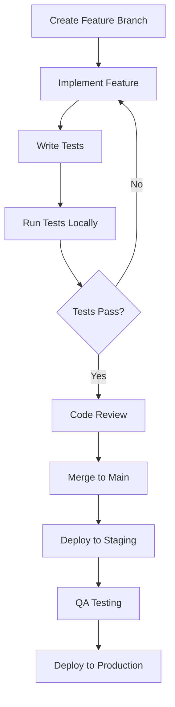

# Development Guide

## Getting Started

This guide will help you set up your development environment and contribute to the Triage-BIOS.ai project.

## Prerequisites

### Required Software

- **Flutter SDK**: 3.8.1 or higher
- **Dart SDK**: 3.8.1 or higher (included with Flutter)
- **Git**: Latest version
- **IDE**: VS Code, Android Studio, or IntelliJ IDEA
- **Node.js**: 18+ (for web development)

### Platform-Specific Requirements

#### iOS Development
- **Xcode**: 14.0 or higher
- **iOS Simulator**: iOS 13.0 or higher
- **Apple Developer Account**: For device testing

#### Android Development
- **Android Studio**: Latest version
- **Android SDK**: API level 21 or higher
- **Android Emulator**: API level 21 or higher

#### Web Development
- **Chrome**: Latest version (for debugging)

## Environment Setup

### 1. Clone the Repository

```bash
git clone https://github.com/triage-bios-ai/triage-bios-ai.git
cd triage-bios-ai
```

### 2. Install Dependencies

```bash
# Install Flutter dependencies
flutter pub get

# Verify Flutter installation
flutter doctor
```

### 3. Environment Configuration

Create environment configuration files:

```bash
# Create environment files
cp .env.example .env.development
cp .env.example .env.production
```

Edit the environment files with your configuration:

```bash
# .env.development
WATSONX_API_KEY=your-development-api-key
WATSONX_PROJECT_ID=your-project-id
ENVIRONMENT=development
DEBUG_MODE=true
LOG_LEVEL=debug

# Health service configurations
APPLE_HEALTH_ENABLED=true
GOOGLE_HEALTH_ENABLED=true
FITBIT_CLIENT_ID=your-fitbit-client-id
FITBIT_CLIENT_SECRET=your-fitbit-client-secret

# Database configuration
DATABASE_URL=sqlite:///data/triage_dev.db
CACHE_ENABLED=true
CACHE_TTL=300

# External services
GOOGLE_MAPS_API_KEY=your-maps-api-key
FIREBASE_PROJECT_ID=your-firebase-project
```

### 4. IDE Setup

#### VS Code Extensions

Install recommended extensions:

```json
{
  "recommendations": [
    "dart-code.dart-code",
    "dart-code.flutter",
    "ms-vscode.vscode-json",
    "bradlc.vscode-tailwindcss",
    "esbenp.prettier-vscode"
  ]
}
```

#### VS Code Settings

```json
{
  "dart.flutterSdkPath": "/path/to/flutter",
  "dart.debugExternalPackageLibraries": true,
  "dart.debugSdkLibraries": false,
  "editor.formatOnSave": true,
  "editor.codeActionsOnSave": {
    "source.fixAll": true
  }
}
```

## Project Structure

```
triage_bios_ai/
├── lib/
│   ├── core/                    # Core utilities and constants
│   │   ├── constants/           # App constants
│   │   ├── errors/             # Error handling
│   │   ├── network/            # Network configuration
│   │   └── utils/              # Utility functions
│   ├── features/               # Feature modules
│   │   ├── triage/             # Triage feature
│   │   │   ├── data/           # Data layer
│   │   │   ├── domain/         # Domain layer
│   │   │   └── presentation/   # Presentation layer
│   │   └── hospital_routing/   # Hospital routing feature
│   ├── shared/                 # Shared components
│   │   ├── services/           # Shared services
│   │   └── widgets/            # Reusable widgets
│   └── main.dart               # App entry point
├── test/                       # Test files
├── docs/                       # Documentation
├── assets/                     # Static assets
└── pubspec.yaml               # Dependencies
```

## Development Workflow

### 1. Feature Development Process



### 2. Branch Naming Convention

```bash
# Feature branches
feature/ai-triage-enhancement
feature/wearable-integration

# Bug fixes
bugfix/vitals-calculation-error
bugfix/ui-rendering-issue

# Hotfixes
hotfix/critical-security-patch

# Documentation
docs/api-reference-update
```

### 3. Commit Message Format

Follow conventional commits:

```bash
# Format
<type>(<scope>): <description>

# Examples
feat(triage): add vitals-enhanced severity scoring
fix(health): resolve Apple Health permission issue
docs(api): update triage endpoint documentation
test(triage): add unit tests for critical case detection
refactor(services): improve error handling in WatsonxService
```

## Code Standards

### 1. Dart Code Style

Follow the official Dart style guide:

```dart
// Good: Use descriptive names
class TriageAssessmentResult {
  final double severityScore;
  final UrgencyLevel urgencyLevel;
  
  const TriageAssessmentResult({
    required this.severityScore,
    required this.urgencyLevel,
  });
}

// Good: Use proper formatting
Future<TriageResult> assessPatientSymptoms({
  required String symptoms,
  PatientVitals? vitals,
}) async {
  final result = await _watsonxService.analyze(symptoms);
  return _enhanceWithVitals(result, vitals);
}
```

### 2. Architecture Patterns

#### Clean Architecture

```dart
// Domain Layer - Business Logic
abstract class TriageRepository {
  Future<Either<Failure, TriageResult>> assessSymptoms(
    AssessSymptomsParams params,
  );
}

// Data Layer - Implementation
class TriageRepositoryImpl implements TriageRepository {
  final TriageRemoteDataSource remoteDataSource;
  final TriageLocalDataSource localDataSource;
  
  @override
  Future<Either<Failure, TriageResult>> assessSymptoms(
    AssessSymptomsParams params,
  ) async {
    try {
      final result = await remoteDataSource.assessSymptoms(params);
      await localDataSource.cacheResult(result);
      return Right(result);
    } catch (e) {
      return Left(ServerFailure(e.toString()));
    }
  }
}
```

#### BLoC Pattern

```dart
// Events
abstract class TriageEvent extends Equatable {}

class AssessSymptomsEvent extends TriageEvent {
  final String symptoms;
  final PatientVitals? vitals;
  
  const AssessSymptomsEvent({
    required this.symptoms,
    this.vitals,
  });
  
  @override
  List<Object?> get props => [symptoms, vitals];
}

// States
abstract class TriageState extends Equatable {}

class TriageInitial extends TriageState {
  @override
  List<Object> get props => [];
}

class TriageLoading extends TriageState {
  @override
  List<Object> get props => [];
}

class TriageSuccess extends TriageState {
  final TriageResult result;
  
  const TriageSuccess(this.result);
  
  @override
  List<Object> get props => [result];
}

// BLoC
class TriageBloc extends Bloc<TriageEvent, TriageState> {
  final AssessSymptomsUseCase assessSymptomsUseCase;
  
  TriageBloc({required this.assessSymptomsUseCase}) : super(TriageInitial()) {
    on<AssessSymptomsEvent>(_onAssessSymptoms);
  }
  
  Future<void> _onAssessSymptoms(
    AssessSymptomsEvent event,
    Emitter<TriageState> emit,
  ) async {
    emit(TriageLoading());
    
    final result = await assessSymptomsUseCase(
      AssessSymptomsParams(
        symptoms: event.symptoms,
        vitals: event.vitals,
      ),
    );
    
    result.fold(
      (failure) => emit(TriageError(failure.message)),
      (triageResult) => emit(TriageSuccess(triageResult)),
    );
  }
}
```

### 3. Error Handling

```dart
// Custom exceptions
class TriageException implements Exception {
  final String message;
  final String code;
  final dynamic details;
  
  const TriageException({
    required this.message,
    required this.code,
    this.details,
  });
  
  @override
  String toString() => 'TriageException: $message (Code: $code)';
}

// Error handling in services
class WatsonxService {
  Future<TriageResult> assessSymptoms(String symptoms) async {
    try {
      final response = await _dio.post('/assess', data: {'symptoms': symptoms});
      return TriageResult.fromJson(response.data);
    } on DioException catch (e) {
      if (e.response?.statusCode == 429) {
        throw TriageException(
          message: 'Rate limit exceeded',
          code: 'RATE_LIMIT_EXCEEDED',
          details: e.response?.data,
        );
      }
      throw TriageException(
        message: 'Network error: ${e.message}',
        code: 'NETWORK_ERROR',
        details: e,
      );
    } catch (e) {
      throw TriageException(
        message: 'Unexpected error: $e',
        code: 'UNKNOWN_ERROR',
        details: e,
      );
    }
  }
}
```

## Testing

### 1. Test Structure

```
test/
├── unit/                       # Unit tests
│   ├── core/
│   ├── features/
│   └── shared/
├── widget/                     # Widget tests
│   ├── features/
│   └── shared/
├── integration/                # Integration tests
└── test_utils/                 # Test utilities
```

### 2. Unit Testing

```dart
// Test file: test/features/triage/domain/usecases/assess_symptoms_usecase_test.dart
import 'package:flutter_test/flutter_test.dart';
import 'package:mockito/mockito.dart';
import 'package:dartz/dartz.dart';

class MockTriageRepository extends Mock implements TriageRepository {}

void main() {
  group('AssessSymptomsUseCase', () {
    late AssessSymptomsUseCase useCase;
    late MockTriageRepository mockRepository;

    setUp(() {
      mockRepository = MockTriageRepository();
      useCase = AssessSymptomsUseCase(mockRepository);
    });

    test('should return TriageResult when assessment is successful', () async {
      // Arrange
      const params = AssessSymptomsParams(symptoms: 'chest pain');
      final expectedResult = TriageResult(
        assessmentId: 'test_id',
        severityScore: 8.0,
        urgencyLevel: UrgencyLevel.critical,
        explanation: 'Test explanation',
        keySymptoms: ['chest pain'],
        recommendedActions: ['Call 911'],
        aiModelVersion: 'test_version',
        timestamp: DateTime.now(),
      );

      when(mockRepository.assessSymptoms(params))
          .thenAnswer((_) async => Right(expectedResult));

      // Act
      final result = await useCase(params);

      // Assert
      expect(result, Right(expectedResult));
      verify(mockRepository.assessSymptoms(params));
      verifyNoMoreInteractions(mockRepository);
    });
  });
}
```

### 3. Widget Testing

```dart
// Test file: test/features/triage/presentation/widgets/triage_form_test.dart
import 'package:flutter/material.dart';
import 'package:flutter_test/flutter_test.dart';
import 'package:flutter_bloc/flutter_bloc.dart';

void main() {
  group('TriageForm Widget', () {
    late TriageBloc triageBloc;

    setUp(() {
      triageBloc = MockTriageBloc();
    });

    testWidgets('should display symptom input field', (tester) async {
      // Arrange
      await tester.pumpWidget(
        MaterialApp(
          home: BlocProvider<TriageBloc>(
            create: (_) => triageBloc,
            child: const TriageForm(),
          ),
        ),
      );

      // Act & Assert
      expect(find.byType(TextFormField), findsOneWidget);
      expect(find.text('Describe your symptoms'), findsOneWidget);
    });

    testWidgets('should submit form when button is pressed', (tester) async {
      // Arrange
      await tester.pumpWidget(
        MaterialApp(
          home: BlocProvider<TriageBloc>(
            create: (_) => triageBloc,
            child: const TriageForm(),
          ),
        ),
      );

      // Act
      await tester.enterText(find.byType(TextFormField), 'chest pain');
      await tester.tap(find.byType(ElevatedButton));
      await tester.pump();

      // Assert
      verify(triageBloc.add(any)).called(1);
    });
  });
}
```

### 4. Integration Testing

```dart
// Test file: integration_test/triage_flow_test.dart
import 'package:flutter/material.dart';
import 'package:flutter_test/flutter_test.dart';
import 'package:integration_test/integration_test.dart';
import 'package:triage_bios_ai/main.dart' as app;

void main() {
  IntegrationTestWidgetsFlutterBinding.ensureInitialized();

  group('Triage Flow Integration Tests', () {
    testWidgets('complete triage assessment flow', (tester) async {
      // Start the app
      app.main();
      await tester.pumpAndSettle();

      // Navigate to triage screen
      await tester.tap(find.text('Start Triage'));
      await tester.pumpAndSettle();

      // Enter symptoms
      await tester.enterText(
        find.byKey(const Key('symptoms_input')),
        'I have chest pain and difficulty breathing',
      );

      // Connect vitals (mock)
      await tester.tap(find.text('Connect Wearable'));
      await tester.pumpAndSettle();

      // Submit assessment
      await tester.tap(find.text('Assess Symptoms'));
      await tester.pumpAndSettle();

      // Verify results
      expect(find.text('CRITICAL'), findsOneWidget);
      expect(find.text('Call 911 immediately'), findsOneWidget);
    });
  });
}
```

## Running Tests

### Command Line

```bash
# Run all tests
flutter test

# Run specific test file
flutter test test/features/triage/triage_service_test.dart

# Run tests with coverage
flutter test --coverage
genhtml coverage/lcov.info -o coverage/html

# Run integration tests
flutter test integration_test/

# Run tests on specific platform
flutter test --platform chrome
flutter test --platform vm
```

### IDE Integration

#### VS Code
- Use the Test Explorer extension
- Run tests with `Ctrl+Shift+P` → "Flutter: Run Tests"
- Debug tests with breakpoints

#### Android Studio
- Right-click test files → "Run Tests"
- Use the built-in test runner
- View coverage reports

## Debugging

### 1. Flutter Inspector

```dart
// Add debug information to widgets
class TriageResultWidget extends StatelessWidget {
  @override
  Widget build(BuildContext context) {
    return Container(
      // Add debug properties
      key: const Key('triage_result_container'),
      child: Column(
        children: [
          // Widget content
        ],
      ),
    );
  }
  
  @override
  void debugFillProperties(DiagnosticPropertiesBuilder properties) {
    super.debugFillProperties(properties);
    properties.add(StringProperty('assessmentId', assessmentId));
    properties.add(DoubleProperty('severityScore', severityScore));
  }
}
```

### 2. Logging

```dart
// Use structured logging
import 'package:logger/logger.dart';

class TriageService {
  final Logger _logger = Logger();
  
  Future<TriageResult> assessSymptoms(String symptoms) async {
    _logger.i('Starting triage assessment', {
      'symptoms_length': symptoms.length,
      'timestamp': DateTime.now().toIso8601String(),
    });
    
    try {
      final result = await _performAssessment(symptoms);
      
      _logger.i('Triage assessment completed', {
        'assessment_id': result.assessmentId,
        'severity_score': result.severityScore,
        'urgency_level': result.urgencyLevel.toString(),
      });
      
      return result;
    } catch (e, stackTrace) {
      _logger.e('Triage assessment failed', e, stackTrace);
      rethrow;
    }
  }
}
```

### 3. Performance Monitoring

```dart
// Add performance tracking
class PerformanceTracker {
  static Future<T> track<T>(
    String operation,
    Future<T> Function() function,
  ) async {
    final stopwatch = Stopwatch()..start();
    
    try {
      final result = await function();
      stopwatch.stop();
      
      Logger().i('Performance: $operation completed in ${stopwatch.elapsedMilliseconds}ms');
      
      return result;
    } catch (e) {
      stopwatch.stop();
      Logger().e('Performance: $operation failed after ${stopwatch.elapsedMilliseconds}ms');
      rethrow;
    }
  }
}

// Usage
final result = await PerformanceTracker.track(
  'triage_assessment',
  () => triageService.assessSymptoms(symptoms),
);
```

## Build and Deployment

### 1. Build Commands

```bash
# Debug builds
flutter build apk --debug
flutter build ios --debug
flutter build web --debug

# Release builds
flutter build apk --release
flutter build ios --release
flutter build web --release

# Build with specific flavor
flutter build apk --flavor production --release
```

### 2. Environment-Specific Builds

```bash
# Development
flutter build apk --dart-define=ENVIRONMENT=development

# Staging
flutter build apk --dart-define=ENVIRONMENT=staging

# Production
flutter build apk --dart-define=ENVIRONMENT=production
```

### 3. CI/CD Pipeline

```yaml
# .github/workflows/ci.yml
name: CI/CD Pipeline

on:
  push:
    branches: [main, develop]
  pull_request:
    branches: [main]

jobs:
  test:
    runs-on: ubuntu-latest
    steps:
      - uses: actions/checkout@v3
      - uses: subosito/flutter-action@v2
        with:
          flutter-version: '3.8.1'
      
      - name: Install dependencies
        run: flutter pub get
      
      - name: Run tests
        run: flutter test --coverage
      
      - name: Upload coverage
        uses: codecov/codecov-action@v3
        with:
          file: coverage/lcov.info

  build:
    needs: test
    runs-on: ubuntu-latest
    steps:
      - uses: actions/checkout@v3
      - uses: subosito/flutter-action@v2
      
      - name: Build APK
        run: flutter build apk --release
      
      - name: Upload artifacts
        uses: actions/upload-artifact@v3
        with:
          name: release-apk
          path: build/app/outputs/flutter-apk/app-release.apk
```

## Contributing Guidelines

### 1. Pull Request Process

1. Fork the repository
2. Create a feature branch
3. Make your changes
4. Add tests for new functionality
5. Ensure all tests pass
6. Update documentation
7. Submit a pull request

### 2. Code Review Checklist

- [ ] Code follows style guidelines
- [ ] Tests are included and passing
- [ ] Documentation is updated
- [ ] No breaking changes (or properly documented)
- [ ] Performance impact considered
- [ ] Security implications reviewed

### 3. Issue Reporting

Use the issue templates:

```markdown
## Bug Report

**Describe the bug**
A clear description of what the bug is.

**To Reproduce**
Steps to reproduce the behavior.

**Expected behavior**
What you expected to happen.

**Screenshots**
If applicable, add screenshots.

**Environment**
- Flutter version:
- Dart version:
- Platform:
- Device:
```

This development guide provides everything needed to contribute effectively to the Triage-BIOS.ai project.