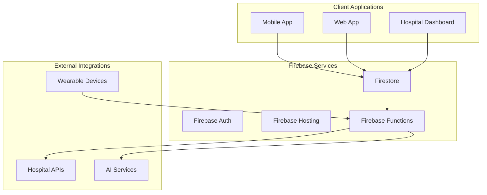

# Triage-BIOS.ai Documentation

## Overview

This documentation provides comprehensive guides for the Firebase Data Integration implementation in Triage-BIOS.ai. The system has been migrated from hardcoded mock data to a robust Firestore-based architecture with support for real-time updates and production hospital integrations.

## Documentation Structure

### 📋 [Firestore Schema Documentation](./firestore-schema.md)
Complete documentation of all Firestore collections, data models, indexes, and security rules.

**Contents:**
- Collection schemas and data types
- Relationship diagrams
- Query patterns and optimization
- Security rules and access control
- Performance considerations
- Backup and recovery procedures

### 🏥 [Hospital Integration Guide](./hospital-integration-guide.md)
Step-by-step guide for configuring production hospital integrations with custom APIs.

**Contents:**
- Integration architecture overview
- Authentication configuration (OAuth, API Key, Certificate)
- Data mapping and transformation
- Real-time synchronization setup
- Testing and validation procedures
- Monitoring and performance tracking

### 🔧 [Troubleshooting Guide](./troubleshooting-guide.md)
Solutions for common Firestore and real-time update issues.

**Contents:**
- Common Firestore errors and solutions
- Real-time listener troubleshooting
- Performance optimization techniques
- Network connectivity issues
- Offline persistence problems
- Emergency procedures and recovery

## Configuration Files

### Environment Templates
- `config/env.development.template` - Development environment configuration
- `config/env.staging.template` - Staging environment configuration  
- `config/env.production.template` - Production environment configuration

### Deployment Configuration
- `config/firebase-deploy.json` - Comprehensive deployment configuration
- `scripts/deploy-firebase.sh` - Unix/Linux deployment script
- `scripts/deploy-firebase.bat` - Windows deployment script

## Quick Start Guide

### 1. Environment Setup

1. **Copy Environment Template**
   ```bash
   cp config/env.development.template .env.development
   ```

2. **Update Configuration Values**
   Edit `.env.development` with your Firebase project details:
   ```bash
   FIREBASE_PROJECT_ID=your-project-id
   FIREBASE_API_KEY=your-api-key
   # ... other configuration values
   ```

3. **Install Dependencies**
   ```bash
   flutter pub get
   npm install -g firebase-tools
   ```

### 2. Firebase Setup

1. **Login to Firebase**
   ```bash
   firebase login
   ```

2. **Initialize Project**
   ```bash
   firebase init
   ```

3. **Deploy Firestore Rules**
   ```bash
   firebase deploy --only firestore:rules,firestore:indexes
   ```

### 3. Development Workflow

1. **Start Emulators** (Development)
   ```bash
   firebase emulators:start
   ```

2. **Run Application**
   ```bash
   flutter run -d web
   ```

3. **Deploy to Staging**
   ```bash
   ./scripts/deploy-firebase.sh -e staging
   ```

## Architecture Overview



## Key Features Implemented

### ✅ Firestore Collections
- Hospital data management
- Real-time capacity monitoring
- Patient vitals storage
- Triage results persistence
- Consent management with audit trails

### ✅ Real-time Updates
- Hospital capacity monitoring
- Patient vitals streaming
- Automatic notifications
- Conflict resolution

### ✅ Production Integration Framework
- Configurable data sources
- Hospital API integration
- Automatic fallback mechanisms
- Data synchronization services

### ✅ Security and Compliance
- Role-based access control
- HIPAA compliance features
- Data encryption
- Audit logging

### ✅ Offline Support
- Firestore offline persistence
- Intelligent caching
- Sync conflict resolution
- Manual sync triggers

## Development Guidelines

### Code Organization
```
lib/
├── services/
│   ├── firestore_data_service.dart
│   ├── hospital_service.dart
│   └── data_migration_service.dart
├── models/
│   ├── hospital.dart
│   ├── patient_vitals.dart
│   └── triage_result.dart
└── utils/
    ├── error_handler.dart
    └── performance_monitor.dart
```

### Best Practices

1. **Error Handling**
   - Always implement comprehensive error handling
   - Use retry mechanisms with exponential backoff
   - Log errors with appropriate context

2. **Performance**
   - Use proper Firestore indexes
   - Implement pagination for large datasets
   - Monitor query performance

3. **Security**
   - Validate all user inputs
   - Use proper authentication and authorization
   - Encrypt sensitive data

4. **Testing**
   - Write unit tests for all service methods
   - Implement integration tests for data flows
   - Use Firebase emulators for testing

## Monitoring and Maintenance

### Key Metrics to Monitor
- Query response times
- Error rates
- Real-time listener connections
- Cache hit rates
- API integration health

### Regular Maintenance Tasks
- Review and update security rules
- Monitor Firestore usage and costs
- Update hospital API configurations
- Perform security audits
- Review and archive old data

### Emergency Procedures
- Service outage response
- Data corruption recovery
- Security incident handling
- Performance degradation mitigation

## Support and Resources

### Internal Resources
- [Firestore Schema Documentation](./firestore-schema.md)
- [Hospital Integration Guide](./hospital-integration-guide.md)
- [Troubleshooting Guide](./troubleshooting-guide.md)

### External Resources
- [Firebase Documentation](https://firebase.google.com/docs)
- [Firestore Best Practices](https://firebase.google.com/docs/firestore/best-practices)
- [Flutter Firebase Integration](https://firebase.flutter.dev/)

### Getting Help
1. Check the troubleshooting guide for common issues
2. Review Firebase Console for error logs
3. Contact the development team for complex issues
4. Escalate to Firebase support for platform issues

## Contributing

### Documentation Updates
1. Keep documentation in sync with code changes
2. Update examples when APIs change
3. Add troubleshooting entries for new issues
4. Review documentation during code reviews

### Configuration Changes
1. Update all environment templates
2. Test configuration changes in staging
3. Document breaking changes
4. Provide migration guides when needed

---

**Last Updated:** December 2024  
**Version:** 1.0.0  
**Maintainer:** Triage-BIOS.ai Development Team