# User Guide

## Welcome to Triage-BIOS.ai 🚨💓

Triage-BIOS.ai is an AI-powered emergency triage system that combines your symptoms with real-time data from wearable devices to provide instant, accurate medical assessments. This guide will help you get the most out of the platform.

## Getting Started

### 1. Download and Install

#### Mobile App (Recommended)
- **iOS**: Download from the App Store
- **Android**: Download from Google Play Store
- **Requirements**: iOS 13.0+ or Android 8.0+

#### Web Application
- Visit [app.triage-bios.ai](https://app.triage-bios.ai)
- Works on all modern browsers
- No installation required

### 2. Create Your Account


1. **Sign Up**: Use your email or sign in with Google/Apple
2. **Verify Email**: Check your inbox for verification link
3. **Complete Profile**: Add basic medical information (optional but recommended)
4. **Connect Devices**: Link your wearable devices for enhanced assessments

### 3. Connect Your Wearable Devices

#### Supported Devices

| Device | Platform | Data Types |
|--------|----------|------------|
| Apple Watch | iOS | Heart Rate, SpO2, Temperature, ECG |
| Galaxy Watch | Android | Heart Rate, SpO2, Blood Pressure |
| Fitbit | iOS/Android | Heart Rate, SpO2, Sleep Data |
| Garmin | iOS/Android | Heart Rate, Stress, Body Battery |
| Oura Ring | iOS/Android | Heart Rate, Temperature, HRV |

#### Connection Process

**For Apple Health (iOS):**
1. Go to Settings → Health Integration
2. Tap "Connect Apple Health"
3. Grant permissions for:
   - Heart Rate ✅
   - Blood Pressure ✅
   - Oxygen Saturation ✅
   - Body Temperature ✅
   - Respiratory Rate ✅

**For Google Health Connect (Android):**
1. Go to Settings → Health Integration
2. Tap "Connect Google Health"
3. Install Health Connect if prompted
4. Grant permissions for vital signs data

## Using the Triage System

### Quick Assessment Flow


### Step-by-Step Assessment

#### 1. Start New Assessment

Tap the **"Start Triage"** button on the home screen.

#### 2. Describe Your Symptoms

**Be Specific and Detailed:**
- ✅ Good: "I have sharp chest pain on the left side that started 30 minutes ago, gets worse when I breathe deeply"
- ❌ Poor: "I don't feel good"

**Include Important Details:**
- When did symptoms start?
- How severe are they (1-10 scale)?
- What makes them better or worse?
- Any associated symptoms?

**Example Descriptions:**

```
Chest Pain:
"I have crushing chest pain in the center of my chest that started 20 minutes ago. It feels like an elephant sitting on my chest and radiates to my left arm. I'm also feeling nauseous and sweaty."

Breathing Issues:
"I'm having trouble breathing and feel short of breath even at rest. This started gradually over the past 2 hours. I also have a cough with some blood-tinged sputum."

Headache:
"I have the worst headache of my life that came on suddenly about an hour ago. It's throbbing and I'm sensitive to light. I also feel nauseous."
```

#### 3. Review Vitals Data

The app will automatically pull your latest vitals from connected devices:

- **Heart Rate**: Normal (60-100 bpm) vs. Concerning (>120 or <50 bpm)
- **Oxygen Saturation**: Normal (>95%) vs. Concerning (<95%)
- **Blood Pressure**: Normal (<140/90) vs. High (>140/90)
- **Temperature**: Normal (97-99°F) vs. Fever (>100.4°F)

**Manual Entry**: If no wearable is connected, you can manually enter vitals if available.

#### 4. Get Your Assessment

The AI will analyze your symptoms and vitals to provide:

**Severity Score (0-10)**
- 0-3: Non-urgent
- 4-5: Standard priority
- 6-7: Urgent
- 8-10: Critical/Life-threatening

**Urgency Level**
- 🟢 **Non-Urgent**: Schedule appointment with primary care
- 🟡 **Standard**: Visit ER when convenient
- 🟠 **Urgent**: Seek care within 1 hour
- 🔴 **Critical**: Call 911 immediately

**Explanation**: Clear reasoning for the assessment
**Recommended Actions**: Specific next steps to take

#### 5. Find Nearby Hospitals (If Needed)

For urgent/critical cases, the app will show:
- Nearest hospitals with real-time capacity
- Estimated travel and wait times
- Hospital specializations and capabilities
- Turn-by-turn directions

## Understanding Your Results

### Severity Score Breakdown

```mermaid
graph LR
    A[Base AI Score<br/>Symptom Analysis] --> C[Final Score]
    B[Vitals Boost<br/>+0 to +3 points] --> C
    C --> D{Score ≥ 8?}
    D -->|Yes| E[🚨 CRITICAL<br/>Call 911]
    D -->|No| F{Score ≥ 6?}
    F -->|Yes| G[⚠️ URGENT<br/>Seek care in 1hr]
    F -->|No| H{Score ≥ 4?}
    H -->|Yes| I[📋 STANDARD<br/>Visit ER when convenient]
    H -->|No| J[✅ NON-URGENT<br/>Schedule appointment]
```



### How Vitals Enhance Your Score

Your wearable device data can increase your severity score when concerning patterns are detected:

**Heart Rate Impact:**
- Tachycardia (>120 bpm): +2.0 points
- Bradycardia (<50 bpm): +2.5 points
- Mild elevation (100-120 bpm): +1.0 point

**Oxygen Saturation Impact:**
- Critical hypoxemia (<90%): +3.0 points
- Mild hypoxemia (90-95%): +1.5 points

**Temperature Impact:**
- High fever (>103°F): +2.5 points
- Moderate fever (101.5-103°F): +1.5 points

**Blood Pressure Impact:**
- Hypertensive crisis (>180/120): +3.0 points
- Hypotension (<90/60): +2.0 points

### Sample Assessment Results

#### Example 1: Non-Critical Case
```
Symptoms: "I have a mild headache and feel tired"
Vitals: HR 75, SpO2 98%, Temp 98.6°F

Assessment:
• Severity Score: 3.5/10 (3.0 base + 0.5 vitals)
• Urgency Level: NON-URGENT
• Explanation: Mild symptoms with normal vitals suggest routine care
• Actions: Rest, hydration, schedule appointment if persists
```

#### Example 2: Critical Case
```
Symptoms: "Severe chest pain, difficulty breathing, sweating"
Vitals: HR 135, SpO2 89%, Temp 99.1°F

Assessment:
• Severity Score: 10.0/10 (7.0 base + 3.0 vitals)
• Urgency Level: CRITICAL
• Explanation: Cardiac symptoms with concerning vitals require immediate care
• Actions: Call 911 immediately, do not drive yourself
• Vitals Impact: High heart rate and low oxygen significantly increased urgency
```

## Features and Settings

### Health Data Management

#### Privacy Controls
- **Data Sharing**: Choose what data to share with hospitals
- **Consent Management**: Grant/revoke permissions anytime
- **Data Retention**: Control how long data is stored
- **Export Data**: Download your health data anytime

#### Vitals Monitoring
- **Real-time Sync**: Automatic updates from wearables
- **Data Quality**: See reliability scores for your vitals
- **Trend Analysis**: View patterns over time
- **Alerts**: Get notified of concerning changes

### Emergency Contacts

Set up emergency contacts who will be notified for critical assessments:

1. Go to Settings → Emergency Contacts
2. Add up to 3 contacts
3. Choose notification preferences:
   - SMS for critical cases
   - Email for all assessments
   - Push notifications

### Medical Profile

Enhance assessment accuracy by providing:

**Basic Information:**
- Age, gender, weight, height
- Primary language
- Insurance information

**Medical History:**
- Chronic conditions (diabetes, hypertension, etc.)
- Current medications
- Known allergies
- Previous surgeries

**Emergency Information:**
- Emergency contacts
- Preferred hospital
- Special medical needs

### Notification Settings

Customize how you receive updates:

- **Assessment Complete**: Get notified when results are ready
- **Critical Alerts**: Immediate notifications for emergency cases
- **Vitals Alerts**: Warnings for concerning vital sign patterns
- **Appointment Reminders**: Follow-up care reminders

## Hospital Integration

### For Patients

When you're routed to a hospital, the system can:

- **Pre-register** you for faster check-in
- **Share assessment** with medical staff (with your consent)
- **Provide updates** on wait times and queue position
- **Send notifications** when it's time for treatment

### Queue Management

Track your status in real-time:


- **Position**: Your place in line
- **Estimated Wait**: Time until treatment
- **Updates**: Real-time status changes
- **Delays**: Transparent communication about delays

## Safety and Privacy

### Data Security

- **End-to-End Encryption**: All data encrypted in transit and at rest
- **HIPAA Compliant**: Meets healthcare privacy standards
- **Minimal Data**: Only necessary information is collected
- **User Control**: You decide what data to share and when

### Medical Disclaimer

⚠️ **Important**: Triage-BIOS.ai is a decision support tool, not a replacement for professional medical judgment.

- **Always call 911** for life-threatening emergencies
- **Consult healthcare providers** for medical decisions
- **Use clinical judgment** - the AI is a tool to assist, not replace, medical professionals
- **Not diagnostic** - this system provides triage recommendations, not medical diagnoses

### When to Call 911 Immediately

Regardless of your assessment score, call 911 immediately if you experience:

- **Chest pain** with shortness of breath, sweating, or nausea
- **Difficulty breathing** or can't catch your breath
- **Severe allergic reaction** with swelling or difficulty breathing
- **Signs of stroke** (face drooping, arm weakness, speech difficulty)
- **Severe bleeding** that won't stop
- **Loss of consciousness** or severe confusion
- **Severe burns** or major trauma
- **Thoughts of self-harm**

## Troubleshooting

### Common Issues

#### Wearable Device Not Connecting

1. **Check Permissions**: Ensure health permissions are granted
2. **Restart App**: Close and reopen the app
3. **Sync Device**: Manually sync your wearable device
4. **Update Apps**: Ensure both apps are up to date
5. **Contact Support**: If issues persist

#### Assessment Taking Too Long

1. **Check Internet**: Ensure stable internet connection
2. **Retry**: Tap "Retry Assessment" if it times out
3. **Simplify Input**: Try shorter, clearer symptom descriptions
4. **Contact Support**: Report persistent issues

#### Inaccurate Results

1. **Review Input**: Check that symptoms were described accurately
2. **Update Vitals**: Ensure wearable data is current
3. **Medical Profile**: Complete your medical profile for better accuracy
4. **Feedback**: Use the feedback feature to report issues

### Getting Help

#### In-App Support
- **Help Center**: Access FAQs and guides
- **Chat Support**: Real-time assistance
- **Feedback**: Report bugs or suggest improvements

#### Emergency Support
- **24/7 Hotline**: 1-800-TRIAGE-1 for urgent technical issues
- **Emergency Override**: Manual assessment if system is down

#### Contact Information
- **Email**: support@triage-bios.ai
- **Phone**: 1-800-874-2431
- **Website**: [help.triage-bios.ai](https://help.triage-bios.ai)

## Tips for Best Results

### Symptom Description Best Practices

1. **Be Specific**: Include location, quality, timing, and severity
2. **Use Your Own Words**: Don't worry about medical terminology
3. **Include Context**: What were you doing when symptoms started?
4. **Mention Changes**: How have symptoms changed over time?
5. **Associated Symptoms**: Include all related symptoms

### Wearable Device Optimization

1. **Wear Consistently**: Keep devices on for continuous monitoring
2. **Keep Updated**: Ensure device firmware is current
3. **Proper Fit**: Devices should be snug but comfortable
4. **Regular Sync**: Sync data regularly for accuracy
5. **Battery Management**: Keep devices charged

### When to Use the System

**Good Use Cases:**
- New or concerning symptoms
- Uncertainty about urgency level
- Need for hospital routing
- Tracking symptom patterns

**Not Recommended For:**
- Life-threatening emergencies (call 911)
- Routine medication questions
- Chronic condition management
- Mental health crises (call crisis line)

## Frequently Asked Questions

### General Questions

**Q: How accurate is the AI assessment?**
A: Our AI has been trained on extensive medical datasets and shows high accuracy in triage decisions. However, it's a decision support tool and should not replace professional medical judgment.

**Q: Does this replace seeing a doctor?**
A: No, this system helps determine urgency and routing but is not a substitute for professional medical care.

**Q: How much does it cost?**
A: Basic triage assessments are free. Premium features like advanced analytics and family accounts have subscription options.

### Privacy and Security

**Q: Who can see my health data?**
A: Only you control your data. Healthcare providers only see information you explicitly consent to share.

**Q: Is my data stored securely?**
A: Yes, all data is encrypted and stored according to HIPAA standards with multiple security layers.

**Q: Can I delete my data?**
A: Yes, you can delete your account and all associated data at any time through the app settings.

### Technical Questions

**Q: What if I don't have a wearable device?**
A: The system works without wearables but is more accurate with vitals data. You can manually enter vitals if available.

**Q: Does it work offline?**
A: Basic functionality works offline, but AI assessments require an internet connection.

**Q: Which devices are supported?**
A: We support Apple Health, Google Health Connect, Fitbit, Garmin, and other major platforms.

---

**Remember**: In any life-threatening emergency, call 911 immediately. Triage-BIOS.ai is designed to help with medical decision-making, but your safety is the top priority.