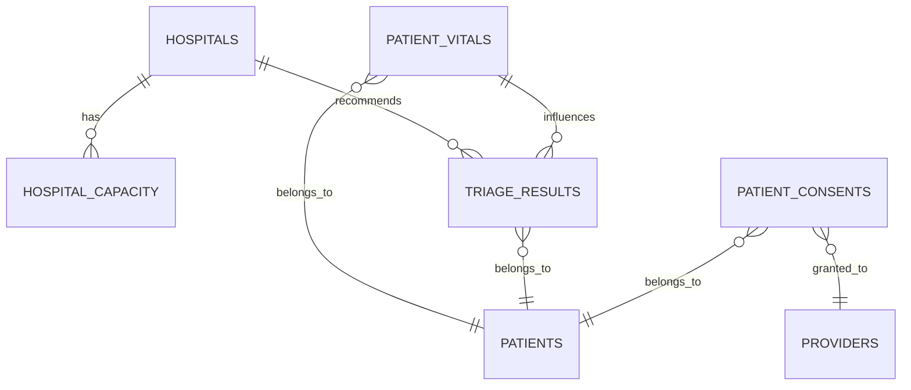

# Firestore Schema Documentation

## Overview

This document provides comprehensive documentation for the Firestore collections and data models used in the Triage-BIOS.ai application. The schema is designed to support real-time hospital capacity monitoring, patient data management, and production hospital integrations.

## Collections Structure

```
firestore/
├── hospitals/
├── hospital_capacity/
├── patient_vitals/
├── triage_results/
├── patient_consents/
├── device_status/
└── audit_logs/
```

## Collection Schemas

### 1. Hospitals Collection

**Collection Path:** `/hospitals/{hospitalId}`

```typescript
interface Hospital {
  id: string;                    // Auto-generated document ID
  name: string;                  // Hospital name
  address: {
    street: string;
    city: string;
    state: string;
    zipCode: string;
    country: string;
  };
  location: {
    latitude: number;            // GPS coordinates
    longitude: number;
  };
  contact: {
    phone: string;               // Primary contact number
    email: string;               // Contact email
    website?: string;            // Optional website URL
  };
  traumaLevel: number;           // 1-4 (1 = highest level)
  specializations: string[];     // Medical specializations
  certifications: string[];     // Hospital certifications
  operatingHours: {
    emergency: string;           // Usually "24/7"
    general: string;             // General operating hours
  };
  createdAt: Timestamp;          // Creation timestamp
  updatedAt: Timestamp;          // Last update timestamp
  isActive: boolean;             // Active status
}
```

**Indexes Required:**
- `location` (geo-point)
- `traumaLevel` (ascending)
- `specializations` (array-contains)
- `isActive` (ascending)

**Security Rules:**
- Read: Public access
- Write: Admin and hospital_admin roles only

### 2. Hospital Capacity Collection

**Collection Path:** `/hospital_capacity/{capacityId}`

```typescript
interface HospitalCapacity {
  id: string;                    // Auto-generated document ID
  hospitalId: string;            // Reference to hospital document
  totalBeds: number;             // Total bed capacity
  availableBeds: number;         // Currently available beds
  icuBeds: number;               // Total ICU beds
  icuAvailable: number;          // Available ICU beds
  emergencyBeds: number;         // Total emergency beds
  emergencyAvailable: number;    // Available emergency beds
  staffOnDuty: number;           // Current staff count
  patientsInQueue: number;       // Patients waiting
  averageWaitTime: number;       // Wait time in minutes
  occupancyRate: number;         // Calculated: (totalBeds - availableBeds) / totalBeds
  lastUpdated: Timestamp;        // Last capacity update
  dataSource: 'firestore' | 'custom_api';  // Data source type
  isRealTime: boolean;           // Real-time update capability
}
```

**Indexes Required:**
- `hospitalId` (ascending)
- `lastUpdated` (descending)
- `occupancyRate` (ascending)
- `availableBeds` (descending)

**Security Rules:**
- Read: Public access
- Write: Admin, hospital_admin, and hospital staff roles

### 3. Patient Vitals Collection

**Collection Path:** `/patient_vitals/{vitalId}`

```typescript
interface PatientVitals {
  id: string;                    // Auto-generated document ID
  patientId: string;             // Patient identifier (hashed)
  deviceId?: string;             // Source device ID
  heartRate?: number;            // BPM (60-200 normal range)
  bloodPressureSystolic?: number; // mmHg (90-140 normal range)
  bloodPressureDiastolic?: number; // mmHg (60-90 normal range)
  oxygenSaturation?: number;     // Percentage (95-100 normal)
  temperature?: number;          // Celsius (36-37.5 normal)
  respiratoryRate?: number;      // Breaths per minute (12-20 normal)
  source: 'apple_health' | 'google_fit' | 'manual' | 'device';
  accuracy: number;              // Confidence score 0-1
  timestamp: Timestamp;          // Measurement timestamp
  isValidated: boolean;          // Medical validation status
}
```

**Indexes Required:**
- `patientId` (ascending)
- `timestamp` (descending)
- `source` (ascending)
- `isValidated` (ascending)

**Security Rules:**
- Read/Write: Patient owner, healthcare providers, admin only

### 4. Triage Results Collection

**Collection Path:** `/triage_results/{resultId}`

```typescript
interface TriageResult {
  id: string;                    // Auto-generated document ID
  patientId: string;             // Patient identifier (hashed)
  sessionId: string;             // Triage session ID
  symptoms: string;              // Patient-reported symptoms
  severityScore: number;         // 0-10 severity scale
  urgencyLevel: 'NON_URGENT' | 'STANDARD' | 'URGENT' | 'CRITICAL';
  aiReasoning: string;           // AI assessment explanation
  recommendedActions: string[];  // Recommended next steps
  vitalsContribution: number;    // Vitals impact on assessment (0-1)
  confidence: number;            // AI confidence score (0-1)
  recommendedHospitalId?: string; // Suggested hospital
  estimatedWaitTime?: number;    // Expected wait time in minutes
  createdAt: Timestamp;          // Assessment timestamp
  geminiModelVersion: string;    // AI model version used
}
```

**Indexes Required:**
- `patientId` (ascending)
- `createdAt` (descending)
- `urgencyLevel` (ascending)
- `severityScore` (descending)

**Security Rules:**
- Read/Write: Healthcare providers, admin only
- Patient can read their own results

### 5. Patient Consents Collection

**Collection Path:** `/patient_consents/{consentId}`

```typescript
interface PatientConsent {
  id: string;                    // Auto-generated document ID
  patientId: string;             // Patient identifier (hashed)
  providerId: string;            // Healthcare provider ID
  consentType: 'treatment' | 'data_sharing' | 'emergency';
  dataScopes: string[];          // Permitted data access scopes
  grantedAt: Timestamp;          // Consent grant timestamp
  expiresAt?: Timestamp;         // Optional expiration
  revokedAt?: Timestamp;         // Revocation timestamp
  isActive: boolean;             // Current consent status
  blockchainTxId: string;        // Blockchain transaction ID
  ipAddress: string;             // IP address of consent action
  consentDetails: Record<string, any>; // Additional consent metadata
}
```

**Indexes Required:**
- `patientId` (ascending)
- `providerId` (ascending)
- `consentType` (ascending)
- `isActive` (ascending)
- `grantedAt` (descending)

**Security Rules:**
- Read/Write: Patient owner, authorized provider, admin only

## Data Relationships



## Query Patterns

### Common Queries

#### Find Hospitals by Location
```typescript
const nearbyHospitals = await db.collection('hospitals')
  .where('isActive', '==', true)
  .orderBy('location')
  .startAt(geopoint)
  .endAt(geopoint)
  .limit(10)
  .get();
```

#### Get Hospital Capacity
```typescript
const capacity = await db.collection('hospital_capacity')
  .where('hospitalId', '==', hospitalId)
  .orderBy('lastUpdated', 'desc')
  .limit(1)
  .get();
```

#### Patient Vitals History
```typescript
const vitals = await db.collection('patient_vitals')
  .where('patientId', '==', patientId)
  .where('timestamp', '>=', startDate)
  .where('timestamp', '<=', endDate)
  .orderBy('timestamp', 'desc')
  .get();
```

#### Triage Results by Urgency
```typescript
const urgentCases = await db.collection('triage_results')
  .where('urgencyLevel', 'in', ['URGENT', 'CRITICAL'])
  .where('createdAt', '>=', today)
  .orderBy('createdAt', 'desc')
  .get();
```

## Performance Considerations

### Indexing Strategy
- Create composite indexes for multi-field queries
- Use single-field indexes for simple filters
- Monitor index usage in Firebase Console

### Query Optimization
- Limit result sets with `.limit()`
- Use pagination for large datasets
- Implement proper caching strategies
- Use real-time listeners judiciously

### Data Size Management
- Implement data archiving for old records
- Use subcollections for large nested data
- Consider data partitioning by date/region

## Security Best Practices

### Data Access Patterns
- Use Firebase Authentication for user identification
- Implement role-based access control (RBAC)
- Validate all data inputs on client and server
- Audit all sensitive data access

### PII Protection
- Hash patient identifiers
- Encrypt sensitive fields
- Implement data retention policies
- Provide data export/deletion capabilities

### Compliance Requirements
- HIPAA compliance for patient data
- GDPR compliance for EU users
- Regular security audits
- Data breach notification procedures

## Backup and Recovery

### Automated Backups
- Daily Firestore exports to Cloud Storage
- Cross-region backup replication
- Point-in-time recovery capability
- Backup integrity verification

### Disaster Recovery
- Multi-region deployment strategy
- Automated failover procedures
- Data synchronization protocols
- Recovery time objectives (RTO < 4 hours)

## Monitoring and Alerting

### Key Metrics
- Query performance and latency
- Document read/write operations
- Real-time listener connections
- Error rates and types

### Alert Thresholds
- Query latency > 2 seconds
- Error rate > 1%
- Concurrent connections > 10,000
- Storage usage > 80% of quota

## Migration Considerations

### Data Migration Steps
1. Export existing mock data
2. Transform to Firestore schema
3. Validate data integrity
4. Import to Firestore collections
5. Update application code
6. Test end-to-end functionality

### Rollback Strategy
- Maintain parallel data sources during migration
- Implement feature flags for data source switching
- Automated rollback triggers on error thresholds
- Data consistency validation procedures