# Hospital Integration Configuration Guide

## Overview

This guide provides step-by-step instructions for configuring production hospital integrations with the Triage-BIOS.ai system. The system supports multiple data sources including Firestore (development/fallback) and custom hospital APIs (production).

## Integration Architecture

```mermaid
graph TB
    subgraph "Triage-BIOS.ai System"
        DS[Data Source Manager]
        FS[Firestore Service]
        API[Hospital API Client]
        CACHE[Cache Layer]
    end
    
    subgraph "Hospital Systems"
        HIS[Hospital Information System]
        EMR[Electronic Medical Records]
        BMS[Bed Management System]
        API_GW[Hospital API Gateway]
    end
    
    DS --> FS
    DS --> API
    API --> CACHE
    API --> API_GW
    API_GW --> HIS
    API_GW --> EMR
    API_GW --> BMS
```



## Configuration Types

### 1. Development Configuration (Firestore Only)
- Uses seeded Firestore data
- No external API dependencies
- Full offline support
- Real-time updates within app ecosystem

### 2. Hybrid Configuration (Firestore + Hospital APIs)
- Firestore as primary data store
- Hospital APIs for real-time capacity updates
- Automatic fallback to Firestore
- Configurable per hospital

### 3. Production Configuration (Multi-source)
- Custom API integration for hospitals
- Firestore as cache and fallback
- Real-time synchronization
- Full production monitoring

## Hospital Integration Setup

### Step 1: Hospital Registration

Create a hospital configuration entry in Firestore:

```typescript
// Example hospital configuration
const hospitalConfig = {
  hospitalId: "hospital_001",
  name: "Metro General Hospital",
  integrationType: "custom_api", // or "firestore"
  apiConfig: {
    baseUrl: "https://api.metrogeneral.com/v1",
    authType: "oauth", // "oauth", "api_key", or "certificate"
    credentials: {
      clientId: "your_client_id",
      clientSecret: "your_client_secret",
      scope: "capacity:read vitals:write"
    },
    endpoints: {
      capacity: "/capacity/current",
      vitals: "/patients/{patientId}/vitals",
      admissions: "/admissions/queue"
    },
    syncInterval: 5, // minutes
    timeout: 30000, // milliseconds
    retryAttempts: 3
  },
  fallbackToFirestore: true,
  realTimeEnabled: true,
  isActive: true
};
```### Step 2:
 Authentication Configuration

#### OAuth 2.0 Setup
```typescript
const oauthConfig = {
  authType: "oauth",
  credentials: {
    clientId: process.env.HOSPITAL_CLIENT_ID,
    clientSecret: process.env.HOSPITAL_CLIENT_SECRET,
    tokenUrl: "https://auth.hospital.com/oauth/token",
    scope: "capacity:read patients:read",
    grantType: "client_credentials"
  }
};
```

#### API Key Setup
```typescript
const apiKeyConfig = {
  authType: "api_key",
  credentials: {
    apiKey: process.env.HOSPITAL_API_KEY,
    keyHeader: "X-API-Key", // or "Authorization"
    keyPrefix: "Bearer " // optional prefix
  }
};
```

#### Certificate-based Authentication
```typescript
const certConfig = {
  authType: "certificate",
  credentials: {
    certPath: "/path/to/client.crt",
    keyPath: "/path/to/client.key",
    caPath: "/path/to/ca.crt",
    passphrase: process.env.CERT_PASSPHRASE
  }
};
```

### Step 3: Data Mapping Configuration

Define how hospital API data maps to Firestore schema:

```typescript
const dataMapping = {
  capacity: {
    apiField: "bed_status",
    firestoreField: "availableBeds",
    transform: (value) => parseInt(value.available_count)
  },
  waitTime: {
    apiField: "queue_metrics.average_wait_minutes",
    firestoreField: "averageWaitTime",
    transform: (value) => Math.round(value)
  },
  occupancy: {
    apiField: "occupancy_rate",
    firestoreField: "occupancyRate",
    transform: (value) => parseFloat(value) / 100
  }
};
```

### Step 4: Environment Configuration

Create environment-specific configuration files:

#### Development (.env.development)
```bash
# Firebase Configuration
FIREBASE_PROJECT_ID=triage-bios-dev
FIREBASE_API_KEY=your_dev_api_key
FIREBASE_AUTH_DOMAIN=triage-bios-dev.firebaseapp.com

# Hospital Integration (disabled in dev)
HOSPITAL_INTEGRATION_ENABLED=false
USE_MOCK_DATA=true

# Logging
LOG_LEVEL=debug
ENABLE_FIRESTORE_EMULATOR=true
```

#### Staging (.env.staging)
```bash
# Firebase Configuration
FIREBASE_PROJECT_ID=triage-bios-staging
FIREBASE_API_KEY=your_staging_api_key
FIREBASE_AUTH_DOMAIN=triage-bios-staging.firebaseapp.com

# Hospital Integration (limited)
HOSPITAL_INTEGRATION_ENABLED=true
HOSPITAL_API_TIMEOUT=15000
HOSPITAL_RETRY_ATTEMPTS=2

# Test Hospital APIs
TEST_HOSPITAL_API_URL=https://api-staging.testhospital.com
TEST_HOSPITAL_API_KEY=staging_api_key

# Monitoring
ENABLE_PERFORMANCE_MONITORING=true
LOG_LEVEL=info
```

#### Production (.env.production)
```bash
# Firebase Configuration
FIREBASE_PROJECT_ID=triage-bios-prod
FIREBASE_API_KEY=your_prod_api_key
FIREBASE_AUTH_DOMAIN=triage-bios.firebaseapp.com

# Hospital Integration (full)
HOSPITAL_INTEGRATION_ENABLED=true
HOSPITAL_API_TIMEOUT=30000
HOSPITAL_RETRY_ATTEMPTS=3
HOSPITAL_FALLBACK_ENABLED=true

# Security
ENABLE_API_RATE_LIMITING=true
MAX_REQUESTS_PER_MINUTE=1000
ENABLE_REQUEST_LOGGING=true

# Monitoring
ENABLE_PERFORMANCE_MONITORING=true
ENABLE_ERROR_REPORTING=true
LOG_LEVEL=warn
```

## API Integration Patterns

### 1. Real-time Capacity Updates

```typescript
class HospitalCapacitySync {
  async startRealTimeSync(hospitalId: string) {
    const config = await this.getHospitalConfig(hospitalId);
    
    if (config.realTimeEnabled) {
      // WebSocket connection for real-time updates
      const ws = new WebSocket(config.apiConfig.websocketUrl);
      
      ws.on('message', async (data) => {
        const capacityUpdate = JSON.parse(data);
        await this.updateFirestoreCapacity(hospitalId, capacityUpdate);
      });
      
      ws.on('error', (error) => {
        console.error(`WebSocket error for ${hospitalId}:`, error);
        // Fallback to polling
        this.startPollingSync(hospitalId);
      });
    } else {
      // Polling-based updates
      this.startPollingSync(hospitalId);
    }
  }
  
  async startPollingSync(hospitalId: string) {
    const config = await this.getHospitalConfig(hospitalId);
    
    setInterval(async () => {
      try {
        const capacity = await this.fetchCapacityFromAPI(hospitalId);
        await this.updateFirestoreCapacity(hospitalId, capacity);
      } catch (error) {
        console.error(`Polling sync failed for ${hospitalId}:`, error);
      }
    }, config.apiConfig.syncInterval * 60 * 1000);
  }
}
```

### 2. Data Validation and Transformation

```typescript
class DataValidator {
  validateCapacityData(data: any): boolean {
    const required = ['totalBeds', 'availableBeds', 'lastUpdated'];
    return required.every(field => data.hasOwnProperty(field));
  }
  
  transformAPIData(apiData: any, mapping: any): any {
    const transformed = {};
    
    for (const [firestoreField, config] of Object.entries(mapping)) {
      const apiValue = this.getNestedValue(apiData, config.apiField);
      transformed[firestoreField] = config.transform 
        ? config.transform(apiValue) 
        : apiValue;
    }
    
    return transformed;
  }
  
  private getNestedValue(obj: any, path: string): any {
    return path.split('.').reduce((current, key) => current?.[key], obj);
  }
}
```

### 3. Error Handling and Fallback

```typescript
class HospitalDataService {
  async getHospitalCapacity(hospitalId: string): Promise<HospitalCapacity> {
    const config = await this.getHospitalConfig(hospitalId);
    
    // Try hospital API first
    if (config.integrationType === 'custom_api') {
      try {
        const apiData = await this.fetchFromHospitalAPI(hospitalId);
        
        // Cache successful API response
        await this.cacheCapacityData(hospitalId, apiData);
        
        return apiData;
      } catch (apiError) {
        console.warn(`Hospital API failed for ${hospitalId}:`, apiError);
        
        if (config.fallbackToFirestore) {
          // Fallback to Firestore
          return await this.getCapacityFromFirestore(hospitalId);
        } else {
          throw apiError;
        }
      }
    }
    
    // Use Firestore directly
    return await this.getCapacityFromFirestore(hospitalId);
  }
}
```

## Testing Hospital Integrations

### 1. Unit Tests

```typescript
describe('Hospital API Integration', () => {
  test('should fetch capacity data from API', async () => {
    const mockResponse = {
      bed_status: { available_count: 25, total_count: 100 },
      queue_metrics: { average_wait_minutes: 45 }
    };
    
    jest.spyOn(apiClient, 'get').mockResolvedValue(mockResponse);
    
    const capacity = await hospitalService.getCapacityFromAPI('hospital_001');
    
    expect(capacity.availableBeds).toBe(25);
    expect(capacity.averageWaitTime).toBe(45);
  });
  
  test('should fallback to Firestore on API failure', async () => {
    jest.spyOn(apiClient, 'get').mockRejectedValue(new Error('API Error'));
    
    const capacity = await hospitalService.getHospitalCapacity('hospital_001');
    
    expect(capacity.dataSource).toBe('firestore');
  });
});
```

### 2. Integration Tests

```typescript
describe('End-to-End Hospital Integration', () => {
  test('should sync capacity data from API to Firestore', async () => {
    // Start sync process
    await capacitySync.startRealTimeSync('hospital_001');
    
    // Wait for sync to complete
    await new Promise(resolve => setTimeout(resolve, 1000));
    
    // Verify data in Firestore
    const firestoreData = await db.collection('hospital_capacity')
      .where('hospitalId', '==', 'hospital_001')
      .get();
    
    expect(firestoreData.docs).toHaveLength(1);
    expect(firestoreData.docs[0].data().dataSource).toBe('custom_api');
  });
});
```

## Monitoring and Alerting

### 1. API Health Monitoring

```typescript
class APIHealthMonitor {
  async checkHospitalAPIHealth(hospitalId: string): Promise<HealthStatus> {
    const config = await this.getHospitalConfig(hospitalId);
    const startTime = Date.now();
    
    try {
      const response = await fetch(`${config.apiConfig.baseUrl}/health`);
      const responseTime = Date.now() - startTime;
      
      return {
        hospitalId,
        status: response.ok ? 'healthy' : 'unhealthy',
        responseTime,
        lastChecked: new Date(),
        error: response.ok ? null : `HTTP ${response.status}`
      };
    } catch (error) {
      return {
        hospitalId,
        status: 'error',
        responseTime: Date.now() - startTime,
        lastChecked: new Date(),
        error: error.message
      };
    }
  }
}
```

### 2. Performance Metrics

```typescript
class PerformanceTracker {
  trackAPICall(hospitalId: string, endpoint: string, duration: number) {
    // Send metrics to monitoring service
    this.metricsClient.histogram('hospital_api_duration', duration, {
      hospital_id: hospitalId,
      endpoint: endpoint
    });
  }
  
  trackDataSyncSuccess(hospitalId: string) {
    this.metricsClient.increment('hospital_sync_success', {
      hospital_id: hospitalId
    });
  }
  
  trackDataSyncFailure(hospitalId: string, error: string) {
    this.metricsClient.increment('hospital_sync_failure', {
      hospital_id: hospitalId,
      error_type: error
    });
  }
}
```

## Security Considerations

### 1. API Security

- Use HTTPS for all API communications
- Implement proper authentication and authorization
- Validate and sanitize all API responses
- Use rate limiting to prevent abuse
- Log all API interactions for audit purposes

### 2. Data Protection

- Encrypt sensitive data in transit and at rest
- Implement proper access controls
- Use secure credential storage (environment variables, key vaults)
- Regular security audits and penetration testing
- Compliance with healthcare regulations (HIPAA, GDPR)

### 3. Network Security

- Use VPN or private networks for hospital connections
- Implement IP whitelisting where possible
- Use certificate pinning for mobile applications
- Monitor for suspicious network activity
- Implement DDoS protection

## Troubleshooting Common Issues

### API Connection Issues
1. Verify network connectivity
2. Check API credentials and permissions
3. Validate SSL certificates
4. Review firewall and proxy settings
5. Test with API documentation examples

### Data Synchronization Problems
1. Check data mapping configuration
2. Validate API response format
3. Review transformation functions
4. Monitor sync intervals and timing
5. Check Firestore write permissions

### Performance Issues
1. Optimize API query parameters
2. Implement proper caching strategies
3. Review database indexes
4. Monitor network latency
5. Consider data pagination

## Support and Maintenance

### Regular Maintenance Tasks
- Monitor API health and performance
- Update authentication credentials
- Review and update data mappings
- Perform security audits
- Update documentation

### Emergency Procedures
- API outage response plan
- Data corruption recovery
- Security incident response
- Escalation procedures
- Communication protocols

For additional support, contact the Triage-BIOS.ai development team or refer to the troubleshooting guide.